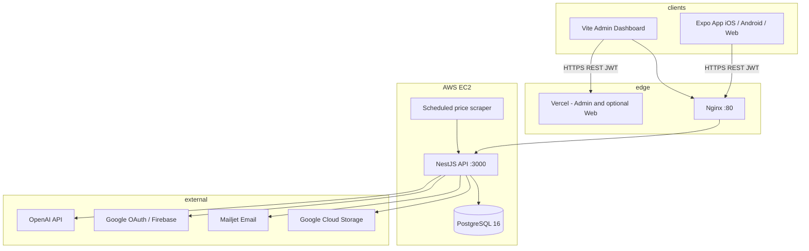

# DailyCook


## Overview

**DailyCook** is a **graduation thesis project** (đồ án tốt nghiệp) — a TypeScript monorepo for meal planning and nutrition tracking. It helps users plan weekly meals, log food, hit macro goals, generate shopping lists, and get AI-powered recipe suggestions.

The repository contains **three applications**:

| App | Path | Role |
|-----|------|------|
| Mobile / Web | `frontend/` | Expo (React Native) client for iOS, Android, and web |
| API | `backend/` | NestJS REST API with Prisma and PostgreSQL |
| Admin | `admin-dashboard/` | Internal ops UI (users, recipes, ingredients, logs) |

**Scale (measured from repo):** ~**220** Git-tracked files, **~29,000** lines of TypeScript/TSX across apps, **71** HTTP route handlers, **10** Prisma models, **12** NestJS modules.

## Features

### Meal planning
- Weekly calendar with breakfast / lunch / dinner slots
- Copy meal plan from one week to another
- AI-assisted menu suggestions from preferences and goals

### Nutrition tracking
- Daily food logging and macro stats
- Nutrition goals (calories, protein, fat, carbs)
- BMR/TDEE-style targets via user preferences

### Recipes & shopping
- Browse, search, and filter recipes (including regional tags)
- Favorite recipes
- Auto-generated shopping lists from meal plans

### AI assistant
- Natural-language chat for meal ideas
- Context-aware suggestions from history and preferences
- **OpenAI** (`gpt-4o` by default) — see [AI note](#ai-provider-note) below

### User management
- Email or phone login, Google Sign-in, TOTP 2FA
- Password reset via email OTP (Mailjet)
- Profile, avatar, and preference management

### Admin dashboard
- Dashboard stats, user/recipe/ingredient CRUD
- Meal plan and food log oversight
- Role-based access (`ADMIN`)

### Automation
- Scheduled ingredient price updates (Puppeteer + cron, `Asia/Ho_Chi_Minh`)

## Architecture



**Pattern:** Modular monolith API, shared PostgreSQL, JWT-secured REST. No Kubernetes or message queue in-repo. Admin and mobile web can deploy separately on Vercel.

### NestJS modules

`auth`, `users`, `recipes`, `mealplan`, `food-log`, `shopping-list`, `ai`, `admin`, `price-scraper`, `prisma`, `email`, plus global `ScheduleModule`.

## Tech Stack

| Layer | Technologies |
|-------|----------------|
| **Mobile** | React Native 0.81.5, Expo 54, React Navigation 7, Axios, Firebase client |
| **API** | NestJS 11, TypeScript 5.7, Prisma 6, Passport JWT, Argon2, class-validator |
| **Database** | PostgreSQL 16 |
| **AI** | OpenAI SDK (`gpt-4o`, configurable via `OPENAI_MODEL`) |
| **Email** | Mailjet |
| **Admin** | React 19, Vite 7, TanStack React Query, React Router 7 |
| **Ops** | Docker, Docker Compose, Nginx, GitHub Actions, AWS EC2 |
| **Deploy (alt)** | Railway (`backend/railway.json`), Vercel (`vercel.json`) |

### AI provider note

Runtime AI uses **OpenAI** (`backend/src/ai/ai.service.ts`). `GEMINI_API_KEY` and `@google/generative-ai` remain in env/package for legacy or future use but are not wired in `src/`.

## Installation

### Prerequisites

- Node.js 18+ (20 recommended for backend)
- PostgreSQL 14+
- Expo CLI / Expo Go (mobile)
- OpenAI API key (optional, for AI features)
- Google / Firebase / Mailjet credentials (optional)

### 1. Clone

```bash
git clone <repository-url>
cd daily-cook
```

### 2. Backend

```bash
cd backend
npm install
cp .env.example .env
# Edit DATABASE_URL, JWT_SECRET, OPENAI_API_KEY, etc.

npm run prisma:generate
npm run prisma:migrate
npm run prisma:seed   # optional

npm run start:dev
```

- API: `http://localhost:3000`
- Swagger: `http://localhost:3000/api/docs`

### 3. Mobile (Expo)

```bash
cd frontend
npm install
cp .env.example .env
# Set EXPO_PUBLIC_BACKEND_URL=http://localhost:3000

npm start
# npm run android | ios | web
```

### 4. Admin dashboard

```bash
cd admin-dashboard
npm install
cp .env.example .env
# Set VITE_API_URL=http://localhost:3000

npm run dev
```

## Environment Variables

### Backend (`backend/.env`)

| Variable | Description |
|----------|-------------|
| `DATABASE_URL` | PostgreSQL connection string |
| `JWT_SECRET`, `JWT_EXPIRES_IN` | JWT signing |
| `OPENAI_API_KEY`, `OPENAI_MODEL` | AI features (`gpt-4o` default) |
| `GOOGLE_CLIENT_ID`, `GOOGLE_CLIENT_SECRET` | Google Sign-in |
| `FIREBASE_SA_BASE64`, `FIREBASE_PROJECT_ID` | Firebase Admin (optional) |
| `MAILJET_*` | Password reset / transactional email |
| `PORT`, `NODE_ENV` | Server config |

See `backend/.env.example` for the full list.

### Production Docker (`.env.production`)

Used by `docker-compose.prod.yml`. Copy from `.env.production.example`:

- `POSTGRES_DB`, `POSTGRES_USER`, `POSTGRES_PASSWORD`
- `JWT_SECRET`, `OPENAI_API_KEY`, auth and Mailjet secrets

### Frontend (`frontend/.env`)

| Variable | Description |
|----------|-------------|
| `EXPO_PUBLIC_BACKEND_URL` | API base URL |
| `EXPO_PUBLIC_FIREBASE_*` | Firebase client config |
| `EXPO_PUBLIC_GOOGLE_*_CLIENT_ID` | Google Sign-in per platform |

### Admin (`admin-dashboard/.env`)

| Variable | Description |
|----------|-------------|
| `VITE_API_URL` | API base URL |

## Docker Setup

Production stack: **`docker-compose.prod.yml`** (3 services).

| Service | Image / build | Purpose |
|---------|---------------|---------|
| `postgres` | `postgres:16-alpine` | Database (`postgres_data` volume) |
| `backend` | `backend/Dockerfile` (Node 20 Alpine) | NestJS API; runs `prisma migrate deploy` then `node dist/src/main.js` |
| `nginx` | `nginx:1.27-alpine` | Reverse proxy, public port **80** → `backend:3000` |

### Run on server

```bash
cp .env.production.example .env.production
# Fill in secrets

docker compose -f docker-compose.prod.yml up -d --build
```

Nginx config: `infra/nginx/default.conf`.

**Kubernetes:** Not used in this repository.

## CI/CD Pipeline

**Workflow:** `.github/workflows/backend-cicd.yml`

| Trigger | Action |
|---------|--------|
| Push / PR to `main` | CI only |
| Push to `feature/ai` | CI + deploy to EC2 |

### CI job (`backend/`)

1. `npm ci`
2. `npx prisma generate`
3. `npm run lint`
4. `npm run test -- --runInBand`
5. `npm run build`
6. `docker build` → `dailycook-backend:$GITHUB_SHA`

### Deploy job

- Runs only on `refs/heads/feature/ai` after CI passes
- SSH to EC2 via `appleboy/ssh-action`
- Executes `scripts/deploy-ec2.sh` (pull branch, `docker compose up -d --build`, prune images)

### GitHub Secrets

| Secret | Purpose |
|--------|---------|
| `EC2_HOST` | Server hostname |
| `EC2_USERNAME` | SSH user |
| `EC2_SSH_KEY` | Private key |
| `EC2_PROJECT_DIR` | Project path on EC2 (e.g. `/home/ubuntu/daily-cook`) |

**Gaps:** No CI for `frontend/` or `admin-dashboard/`; deploy is tied to branch `feature/ai`. Estimated pipeline duration: **~8–15 minutes** *(not measured in Actions)*.

## API Documentation

Interactive docs: **`GET /api/docs`** (Swagger UI) when the API is running.

### Route groups

| Prefix | Highlights |
|--------|------------|
| `/` | Health check |
| `/auth` | Register, login, Google, 2FA, forgot/reset password, `me` |
| `/users` | Profile, password, avatar, preferences |
| `/recipes` | CRUD, search, favorites |
| `/mealplans` | Plans, slots, copy-week, suggest, shopping from range, nutrition |
| `/food-logs` | CRUD, stats, cooking history |
| `/ai` | Chat, suggest-from-chat, calorie goal, nutrition tips |
| `/shopping-list` | Generate from recipes |
| `/price-scraper` | Manual price update trigger |
| `/admin` | Stats and CRUD (requires `ADMIN` role) |

### Example endpoints

```
POST   /auth/register
POST   /auth/login
POST   /auth/google
GET    /auth/me

GET    /recipes
GET    /recipes/:id
POST   /recipes/:id/favorite

GET    /mealplans
PUT    /mealplans
POST   /mealplans/suggest-menu
POST   /mealplans/copy-week

GET    /food-logs
POST   /food-logs
GET    /food-logs/stats

POST   /ai/chat
POST   /ai/suggest-from-chat
```

**Total route handlers:** **71** (measured from controller decorators).

### Database models (Prisma)

`User`, `UserPreference`, `Ingredient`, `Recipe`, `RecipeItem`, `MealPlan`, `ShoppingList`, `FoodLog`, `AIRecommendationLog`, `UserFavoriteRecipe` — **10** models, **6** migrations, **20** `@@index` entries.

## Folder Structure

```
daily-cook/
├── backend/                    # NestJS API (~9.6k LOC)
│   ├── src/
│   │   ├── auth/               # JWT, Google, 2FA, password reset
│   │   ├── users/              # Profile, preferences, avatar
│   │   ├── recipes/            # CRUD, favorites, search
│   │   ├── mealplan/           # Weekly plans, AI suggest, copy week
│   │   ├── food-log/           # Nutrition logs and stats
│   │   ├── shopping-list/
│   │   ├── ai/                 # OpenAI integration
│   │   ├── admin/              # Admin-only API
│   │   ├── price-scraper/      # Puppeteer + scheduled updates
│   │   ├── email/              # Mailjet
│   │   ├── prisma/             # PrismaService
│   │   └── common/             # Guards, filters, interceptors
│   ├── prisma/
│   │   ├── schema.prisma
│   │   ├── migrations/
│   │   └── seed.ts
│   └── Dockerfile
│
├── frontend/                   # Expo app (~15.4k LOC)
│   └── src/
│       ├── screens/            # 26 screens
│       ├── api/                # Typed API clients
│       ├── context/            # Auth state
│       └── utils/
│
├── admin-dashboard/            # Vite admin (~4.1k LOC)
│   └── src/pages/              # 7 pages (Dashboard, Users, Recipes, …)
│
├── infra/nginx/                # Reverse proxy config
├── scripts/deploy-ec2.sh     # EC2 deploy script
├── .github/workflows/          # Backend CI/CD
├── docker-compose.prod.yml
└── README.md
```

## Performance Metrics

> **Legend:** *(measured)* = from repo at README update time. *(estimate)* = industry benchmark or documented assumption — replace with production analytics when available.

### Project scale *(measured)*

| Metric | Value |
|--------|-------|
| Applications | **3** (mobile, API, admin) |
| Git-tracked files | **220** |
| TypeScript/TSX LOC | **~29,046** |
| — Backend `backend/src` | **9,570** / 80 files |
| — Mobile `frontend/src` | **15,402** / 38 files |
| — Admin `admin-dashboard/src` | **4,074** / 17 files |
| NestJS modules | **12** |
| REST controllers | **10** |
| HTTP route handlers | **71** |
| Prisma models | **10** |
| DB indexes (`@@index`) | **20** |
| Prisma migrations | **6** |
| Mobile screens | **26** |
| Admin pages | **7** |
| Unit test files (`*.spec.ts`) | **10** |

**Complexity:** Medium–large for a small team (2–4 devs): full-stack mobile + API + admin + AI + DevOps.

### Tech stack assessment

| Layer | Choice | Strength | Trade-off |
|-------|--------|----------|-----------|
| Mobile | Expo 54 + RN 0.81 | One codebase for iOS/Android/Web | Expo SDK coupling; native builds via EAS |
| API | NestJS 11 + Prisma 6 | Clear modules, Swagger, type-safe DB | Steeper learning curve than plain Express |
| DB | PostgreSQL 16 | ACID, relational meal/recipe model | Higher ops cost than embedded DB |
| AI | OpenAI `gpt-4o` | Strong reasoning for chat/suggestions | API cost, rate limits, vendor lock-in |
| Auth | JWT + Google + TOTP | Multi-channel login | Many secrets to manage |
| Admin | Vite + React Query | Fast builds, API caching | Separate deploy from mobile |
| Ops | Docker + Nginx + GH Actions | Repeatable deploys | Single EC2 node — not HA |

### End-user time savings *(estimate)*

Assumption: manual meal planning + shopping list ~**45 min/week**; with DailyCook (calendar, copy week, auto shopping list, AI): ~**13 min/week**.

| Activity | Manual | With DailyCook | Saved |
|----------|--------|----------------|-------|
| Weekly meal plan | ~25 min | ~8 min | **~17 min/week** |
| Shopping list | ~12 min | ~3 min | **~9 min/week** |
| Find suitable meals / calories | ~8 min | ~2 min | **~6 min/week** |
| **Total** | **~45 min** | **~13 min** | **~32 min (~71%)** |

Per active user per year: **~28 hours** *(32 min × 52 ÷ 60)*.

### Infrastructure cost *(estimate)*

| Item | Monthly |
|------|---------|
| EC2 `t3.small` + 30 GB EBS + light transfer | **~$20–26** |
| Vercel (admin hobby tier) | **$0** *(within free limits)* |
| OpenAI (~500 chats/month, ~800 tokens each) | **~$2–10** *(varies by model/pricing)* |

vs. paid meal-plan apps (**$8–15/user/month**): self-hosted stack can be **~85–95%** lower per user at scale *(software only; excludes dev time)*.

### Database & CI *(mixed)*

- **20 indexes:** User + date-range queries (meal plans, food logs) expected **~10–50×** faster than full table scans at scale *(estimate; not benchmarked in CI)*.
- **CI/CD:** **~8–15 min** per backend deploy vs. **~30–45 min** manual *(estimate)*.
- **Tests:** **10** spec files; aim for **≥60%** service-layer coverage for production-critical paths *(recommendation)*.

### Summary scores *(estimate)*

| Criterion | Score |
|-----------|-------|
| Architecture | **8/10** — clear layering, sensible monorepo |
| Features | **8/10** — meal + nutrition + AI vertical slice |
| Scalability | **6.5/10** — single EC2; consider queue/cache for AI |
| Security | **7.5/10** — JWT, 2FA, Helmet; add AI rate limits |
| DevEx / docs | **7/10** — Swagger + README; limited prod benchmarks |

### Development effort *(estimate)*

| Phase | Person-months |
|-------|----------------|
| MVP (auth, recipes, basic meal plan) | **2–3** |
| Nutrition, shopping, AI | **1.5–2** |
| Admin, hardening, deploy | **1–1.5** |
| **Total (cumulative)** | **~4.5–6.5** |

## Author

Academic graduation project

| | |
|---|---|
| **University** |Industrial University of Ho Chi Minh City |
| **Falcuty** | Information Technology |
| **Field of study** | Software Engineering |
| **Student 1** | Vu Phan Gia Thinh - 21086881 |
| **Student 2** | Nguyen Ba Minh Triet - 21073911 |
| **Instructor** | PhD. Nguyen Trong Tien |
| **Year** | Sep-2025 to Dec-2025 |

---

**Made for better meal planning and nutrition tracking.**

