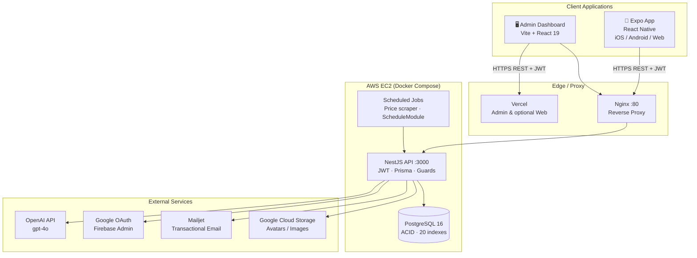

# DailyCook

<p align="center">
  
  
  
  
  
  
  
  
  
</p>

> **Graduation thesis project** — Industrial University of Ho Chi Minh City, Faculty of Information Technology, Software Engineering. Academic year Sep–Dec 2025.

---

## Table of Contents

1. [Overview](#overview)
2. [Architecture](#architecture)
3. [Tech Stack](#tech-stack)
4. [Fullstack Layer Guide](#fullstack-layer-guide)
   - [Mobile App](#mobile-app-frontend)
   - [Backend API](#backend-api-backend)
   - [Admin Dashboard](#admin-dashboard-admin-dashboard)
5. [Data Engineering](#data-engineering)
   - [OLTP vs OLAP layers](#oltp-vs-olap-layers)
   - [Star Schema — Nutrition Analytics](#star-schema--nutrition-analytics)
   - [Snowflake Schema — Recipe Cost Analytics](#snowflake-schema--recipe-cost-analytics)
   - [ETL Pipeline — Ingredient Price Scraper](#etl-pipeline--ingredient-price-scraper)
   - [ELT Pipeline — Nutrition Aggregation](#elt-pipeline--nutrition-aggregation)
   - [AI Data Pipeline](#ai-data-pipeline)
   - [Analytics Queries](#analytics-queries)
6. [Data Model (OLTP)](#data-model-oltp)
7. [API Reference](#api-reference)
8. [DevOps & Infrastructure](#devops--infrastructure)
   - [Production Topology](#production-topology)
   - [Dockerfile — Multi-Stage Build](#dockerfile--multi-stage-build)
   - [Container Startup Sequence](#container-startup-sequence-startsh)
   - [Nginx Reverse Proxy](#nginx-reverse-proxy-infraginxdefaultconf)
   - [Deploy Script](#deploy-script-scriptsdeploy-ec2sh)
9. [CI/CD Pipeline](#cicd-pipeline)
   - [Pipeline Overview](#pipeline-overview)
   - [CI Job](#ci-job--step-by-step)
   - [Deploy Job](#deploy-job)
   - [Pipeline Gaps & Improvements](#pipeline-gaps--recommended-improvements)
10. [Installation](#installation)
11. [Environment Variables](#environment-variables)
12. [Project Structure](#project-structure)
13. [Performance & Scale](#performance--scale)
14. [Author](#author)

---

## Overview

**DailyCook** is a full-stack TypeScript monorepo for meal planning and nutrition tracking. It helps users plan weekly meals, log daily food intake, hit macro goals, generate shopping lists, and get AI-powered recipe suggestions.

### Applications

| App | Path | Stack | Role |
|-----|------|-------|------|
| Mobile / Web | `frontend/` | Expo 54, React Native 0.81.5 | iOS, Android, and web client |
| REST API | `backend/` | NestJS 11, Prisma 6, PostgreSQL 16 | Business logic, data, AI |
| Admin UI | `admin-dashboard/` | React 19, Vite 7, TanStack Query | Internal ops dashboard |

### Key Metrics

| Metric | Value |
|--------|-------|
| Total LOC (TypeScript/TSX) | ~29,000 |
| NestJS modules | 12 |
| REST route handlers | 71 |
| Prisma models | 10 |
| DB indexes | 20 |
| Prisma migrations | 6 |
| Mobile screens | 26 |
| Unit test files | 10 |

---

## Architecture



**Pattern:** Modular monolith API, shared PostgreSQL, JWT-secured REST. Stateless NestJS containers behind Nginx; no Kubernetes or message queue in-repo. Admin and mobile web can deploy independently on Vercel.

### Request Lifecycle

Every authenticated request passes through the same NestJS middleware chain before touching a service:

```
Client (mobile / admin)
  │  HTTPS
  ▼
Nginx :80
  │  proxy_pass http://backend:3000
  │  X-Real-IP, X-Forwarded-For, Upgrade headers
  ▼
NestJS bootstrap (main.ts)
  ├── helmet()               — security headers (CORP, CSP, etc.)
  ├── enableCors()           — origin allowlist, credentials, OPTIONS
  ├── ValidationPipe         — class-validator whitelist + transform
  ├── HttpExceptionFilter    — normalise all errors → { success, status, path, message, timestamp }
  └── LoggingInterceptor     — [METHOD] /path Xms per request

  ▼  route matched
  ├── JwtAuthGuard           — ExtractJwt.fromAuthHeaderAsBearerToken()
  │                            Passport-JWT validates signature + expiry
  │                            attaches { userId, email, role } to req.user
  ├── RolesGuard             — @Roles('ADMIN') decorator check via Reflector
  │                            throws 403 ForbiddenException on mismatch
  ▼
  Controller (@Get/@Post/…)
  ▼
  Service (business logic)
  ├── PrismaService          — PrismaClient, $connect on module init, graceful shutdown hook
  ├── (optional) AIService   — OpenAI SDK, forwardRef circular dep with MealPlanService
  ├── (optional) EmailService — Mailjet node client
  └── (optional) GCS upload  — @google-cloud/storage
  ▼
  PostgreSQL 16
  ▼
  Response → JSON  { data, meta }  or  { success: false, message }
```

### Authentication Flow

```
┌─────────────┐     POST /auth/login      ┌──────────────────────────────┐
│   Client    │ ─────────────────────────► │  AuthService.login()         │
└─────────────┘   { username, password }   │  1. findUnique by email/phone│
                                           │  2. argon2.verify()          │
                                           │  3. isTwoFAEnabled?          │
                                           └──────────┬───────────────────┘
                                                      │ 2FA enabled
                               ┌──────────────────────┴────────────────┐
                               │  returns { requires2FA, tmpToken }     │
                               └──────────────────────┬────────────────┘
                                    Client sends TOTP  │
                               ┌──────────────────────▼────────────────┐
                               │  TotpService (speakeasy)               │
                               │  verifyToken() → sign final JWT        │
                               └───────────────────────────────────────┘
                                           │ 2FA disabled
                               ┌──────────▼──────────────────────────┐
                               │  JwtService.sign()                   │
                               │  payload: { sub, email, role }       │
                               │  expires: JWT_EXPIRES_IN             │
                               └─────────────────────────────────────┘

Google OAuth:  POST /auth/google  →  GoogleAuthLibrary.verifyIdToken()
               →  upsert user (googleId)  →  sign JWT

Password reset: POST /auth/forgot-password  →  6-digit OTP via Mailjet
                POST /auth/reset-password   →  verify OTP  →  argon2.hash(newPw)
```

---

## Tech Stack

| Layer | Key packages | Notes |
|-------|-------------|-------|
| **Mobile** | react-native 0.81.5, expo ~54, react-navigation 7, axios 1.11, firebase 12, expo-auth-session, expo-image-picker | iOS · Android · Web; EAS build (`eas.json`); deep-link scheme `dailycook://` |
| **API** | @nestjs/core 11, typescript 5.7, prisma 6, @nestjs/passport, passport-jwt, argon2, class-validator, class-transformer, helmet, @nestjs/swagger | 12 modules · 71 handlers · global ValidationPipe + HttpExceptionFilter + LoggingInterceptor |
| **Database** | PostgreSQL 16, @prisma/client, prisma CLI | 10 models · 20 `@@index` · 6 migrations · `prisma migrate deploy` at container start |
| **AI** | openai (gpt-4o), @nestjs/schedule (cron) | Chat · menu suggest · calorie goal · nutrition tips; AIRecommendationLog audit trail |
| **Auth** | @nestjs/jwt, passport-jwt, argon2, speakeasy (TOTP), firebase-admin, google-auth-library, node-mailjet | Email/phone login · Google OAuth · TOTP 2FA · OTP password reset |
| **Storage** | Google Cloud Storage (@google-cloud/storage) | Avatars and recipe images; signed URLs |
| **Scraping** | puppeteer, @nestjs/schedule | Daily Puppeteer cron → bachhoaxanh.com → Ingredient price upsert |
| **Email** | node-mailjet | Transactional OTP and reset emails |
| **Admin UI** | react 19, vite 7, @tanstack/react-query 5, react-router-dom 7, axios | ProtectedRoute + localStorage JWT; TanStack Query cache with staleTime |
| **Ops** | docker, docker-compose, nginx 1.27-alpine, github-actions | 3-service compose stack; multi-stage Dockerfile; SSH deploy |
| **Alt deploys** | railway (`backend/railway.json`), vercel (`vercel.json`) | Admin/web front on Vercel hobby; backend on Railway as fallback |

---

## Fullstack Layer Guide

### Mobile App (`frontend/`)

**Navigation tree** (React Navigation 7, `createNativeStackNavigator`):

```
RootNavigator
  ├── LaunchScreen           — splash + onboarding check (AsyncStorage)
  ├── OnboardingScreen / OnboardingScreen2
  ├── Auth stack
  │   ├── SignInEmail / SignUpEmail
  │   ├── ForgotPasswordEmail → ForgotPasswordCode → ResetPassword → ResetPasswordSuccess
  │   └── Firebase Google Sign-In (expo-auth-session + expo-web-browser)
  └── Main stack (requires token in AuthContext)
      ├── TabBar             — bottom tabs: Home · Calendar · Profile
      ├── HomeScreen         — recipe browse + category filter
      ├── CategoryScreen / DetailsScreen
      ├── CalendarScreen     — weekly meal plan (react-native-calendars)
      ├── MealSuggestScreen  — AI menu suggestion
      ├── CookingScreen / CookingHistoryScreen / CookingStatsScreen
      ├── NutritionTrackerScreen / NutritionGoalsScreen (react-native-gifted-charts)
      ├── ShoppingListScreen
      ├── FavoriteRecipesScreen
      └── ProfileScreen → EditProfileScreen / ChangePasswordScreen
```

**HTTP layer** (`src/api/`):

```
http.ts            — axios instance, baseURL from EXPO_PUBLIC_BACKEND_URL
  request interceptor:  AsyncStorage.getItem('token') → Authorization: Bearer <token>
  response interceptor: structured console.error on 4xx/5xx/network error

auth.ts            — loginApi, registerApi, meApi, googleLoginApi
mealplan.ts        — getMealPlan, putMealPlan, suggestMenu, copyWeek
food-log.ts        — getFoodLogs, createFoodLog, getStats
recipes.ts         — getRecipes, getRecipe, toggleFavorite
ai.ts              — chatAI, suggestFromChat, getCalorieGoal
users.ts           — getProfile, updateProfile, updatePreferences, uploadAvatar
```

**State management:** `AuthContext` (React Context + AsyncStorage) holds `user`, `token`, `loading`. No Redux/Zustand — single context sufficient for auth state; server state handled per-screen with direct `useEffect` calls.

**Build targets:**

| Target | Command | Output |
|--------|---------|--------|
| Dev server | `npm start` | Expo Go QR |
| Android APK | `eas build --profile android-apk` | internal `.apk` |
| iOS Ad-hoc | `eas build --profile ios-adhoc` | internal `.ipa` |
| Web | `expo export --platform web` | static `dist/` |

---

### Backend API (`backend/`)

**Module dependency graph:**

```
AppModule
  ├── ConfigModule (global)       — process.env via ConfigService
  ├── ScheduleModule (global)     — cron scheduler
  ├── PrismaModule (global)       — PrismaService singleton
  │
  ├── AuthModule
  │   ├── JwtModule               — signs/verifies JWT
  │   ├── PassportModule          — jwt strategy
  │   ├── TotpService             — speakeasy TOTP
  │   ├── FirebaseAdminProvider   — FIREBASE_SA_BASE64 → admin.initializeApp()
  │   └── EmailService            — Mailjet OTP delivery
  │
  ├── UsersModule
  │   └── FirebaseAdminProvider   — avatar upload to GCS via Firebase Admin
  │
  ├── RecipesModule               — CRUD, full-text search, favorites
  ├── MealPlanModule
  │   └── ← forwardRef → AIModule — circular dep (suggest menu uses AI)
  │
  ├── FoodLogModule               — logs + daily/weekly stats
  ├── ShoppingListModule          — generate list from recipe range
  │
  ├── AIModule
  │   ├── OpenAI SDK              — gpt-4o via process.env.OPENAI_MODEL
  │   └── → MealPlanService       — read existing plan to avoid repetition
  │
  ├── PriceScraperModule          — @Cron('0 2 * * *', {timeZone: 'Asia/Ho_Chi_Minh'})
  │                                  Puppeteer → bachhoaxanh.com → Ingredient upsert
  └── AdminModule                 — @Roles('ADMIN') protected stats + CRUD
```

**Global middleware stack (applied in `main.ts`):**

```typescript
app.use(helmet({ crossOriginResourcePolicy: { policy: 'cross-origin' } }))
app.enableCors({ origin: true, credentials: true, methods: [...] })
app.useGlobalPipes(new ValidationPipe({ whitelist: true, transform: true }))
app.useGlobalFilters(new HttpExceptionFilter())      // → { success, status, path, message }
app.useGlobalInterceptors(new LoggingInterceptor())  // → [METHOD] /path Xms
```

**Swagger setup:**

- Auto-generated from NestJS `@ApiTags`, `@ApiBearerAuth`, `@ApiOperation` decorators
- Bearer auth pre-configured with `JWT-auth` security scheme
- `persistAuthorization: true` — token survives browser refresh
- URL: `GET /api/docs`

**Database migration lifecycle:**

| Command | When | Effect |
|---------|------|--------|
| `prisma migrate dev` | local dev | creates migration file + applies + regenerates client |
| `prisma migrate deploy` | CI & container start | applies pending migrations only, no file creation |
| `prisma generate` | post-install & CI | regenerates `@prisma/client` types from schema |
| `prisma db seed` (tsx) | optional | seeds `Ingredient` nutrition data + sample `Recipe` rows |

Migrations (chronological):

| Migration | Change |
|-----------|--------|
| `20240101000000_init` | Base schema (User, Recipe, Ingredient, MealPlan, FoodLog, …) |
| `20250120000000_add_comprehensive_indexes` | 20 `@@index` entries for user+date queries |
| `20251017065644_dailycook_v0_1` | AI logs, shopping list, favorites |
| `20251018043605_add_phone_and_dob_to_user` | `phone UNIQUE`, `dob` on User |
| `20251018050936_normalize_schema_indices_ref_actions` | Cascade deletes, index cleanup |
| `20251118000000_add_ingredient_pricing` | `pricePerUnit`, `priceCurrency`, `priceUpdatedAt` |

---

### Admin Dashboard (`admin-dashboard/`)

**Routing** (React Router 7):

```
/login           — public, checks role === 'ADMIN' on token rehydration
/                → /dashboard
/dashboard       — aggregate stats (users, recipes, meal plans, food logs)
/users           — paginated table, role update, delete
/recipes         — paginated table, search, delete, RecipeForm modal
/ingredients     — CRUD with inline edit
/meal-plans      — read-only oversight
/food-logs       — read-only oversight
```

**State pattern:** TanStack Query v5 (`useQuery` / `useMutation`) for all server state. `AuthContext` stores JWT in `localStorage` (via `config/api.ts`); `ProtectedRoute` component redirects non-admin users to `/login`.

**Build:** `tsc -b && vite build` → `dist/` — deployed to Vercel via `vercel.json`.

---

## Data Engineering

DailyCook stores operational data in PostgreSQL (OLTP). The section below documents the analytical data models, ETL/ELT pipelines, and data flows that sit on top of — or extend — that OLTP store.

---

### OLTP vs OLAP Layers

```
┌─────────────────────────────────────────────────────────────────────────┐
│  SOURCES (operational)                                                  │
│  PostgreSQL 16 — 10 OLTP models                                         │
│  FoodLog · MealPlan · Recipe · Ingredient · AIRecommendationLog …       │
└────────────────────────┬────────────────────────────────────────────────┘
                         │
             ┌───────────┴──────────┐
             │  ETL / ELT layer     │
             │  (described below)   │
             └───────────┬──────────┘
                         │
        ┌────────────────┼──────────────────┐
        ▼                ▼                  ▼
  Star Schema      Snowflake Schema    AI Feature Store
  (nutrition DWH)  (recipe cost DWH)  (AIRecommendationLog)
        │                │
        └────────────────┘
                 │
         Analytics / BI
         (SQL dashboards, future Metabase / Superset)
```

| Concern | Layer | Location |
|---------|-------|----------|
| Transactional reads/writes | OLTP | `public` schema — Prisma models |
| Nutrition analytics | OLAP | `analytics` schema — Star Schema |
| Recipe cost analytics | OLAP | `analytics` schema — Snowflake Schema |
| Price scraping | ETL | `PriceScraperService` → `Ingredient` |
| Daily macro aggregation | ELT | SQL materialized view / scheduled job |
| AI input/output audit | Feature store | `AIRecommendationLog` |

---

### Star Schema — Nutrition Analytics

**Purpose:** answer questions like *"How many calories did user X consume on weekdays in November, broken down by meal type?"*

```
                        ┌───────────────────┐
                        │   dim_date        │
                        │───────────────────│
                        │ date_key  PK      │
                        │ full_date         │
                        │ day_of_week       │
                        │ week_number       │
                        │ month             │
                        │ quarter           │
                        │ year              │
                        │ is_weekend        │
                        └────────┬──────────┘
                                 │
┌──────────────────┐    ┌────────┴───────────────────────────────────────────┐    ┌──────────────────────┐
│   dim_user       │    │                fact_food_log                       │    │   dim_recipe         │
│──────────────────│    │────────────────────────────────────────────────────│    │──────────────────────│
│ user_key   PK    │◄───│ log_key         PK (surrogate)                     │───►│ recipe_key   PK      │
│ user_id (NK)     │    │ user_key        FK → dim_user                      │    │ recipe_id (NK)       │
│ gender           │    │ date_key        FK → dim_date                      │    │ title                │
│ age_group        │    │ meal_type_key   FK → dim_meal_type                 │    │ region               │
│ activity_level   │    │ recipe_key      FK → dim_recipe                    │    │ diet_tags[]          │
│ diet_type        │    │─────── MEASURES ────────────────────────────────── │    │ cook_time_bucket     │
│ kcal_target      │    │ kcal            FLOAT                              │    │ total_kcal           │
│ goal             │    │ protein_g       FLOAT                              │    │ protein_g            │
│ region           │    │ fat_g           FLOAT                              │    │ fat_g                │
│ valid_from       │    │ carbs_g         FLOAT                              │    │ carbs_g              │
│ valid_to (SCD2)  │    │ fiber_g         FLOAT    (from Ingredient rollup)  │    │ ingredient_count     │
└──────────────────┘    │ sugar_g         FLOAT                              │    └──────────────────────┘
                        │ sodium_mg       FLOAT                              │
                        │ pct_kcal_target FLOAT    (kcal / user.kcal_target) │    ┌──────────────────────┐
                        │ source          VARCHAR  ('app' | 'ai_suggest')    │    │  dim_meal_type       │
                        └────────────────────────────────────────────────────┘    │──────────────────────│
                                                                                  │ meal_type_key  PK    │
                                                                                  │ meal_type            │
                                                                                  │ is_main_meal         │
                                                                                  └──────────────────────┘
```

**Slowly Changing Dimension (SCD Type 2)** on `dim_user`: when a user changes `goal`, `kcal_target`, or `diet_type`, a new row is inserted with updated `valid_from`/`valid_to` — preserving historical accuracy of past food logs.

**Grain:** one row per food log entry (one meal per user per day per meal type).

---

### Snowflake Schema — Recipe Cost Analytics

**Purpose:** answer *"What is the estimated cost per 100 kcal for each recipe, and how did it change week over week as ingredient prices were updated?"*

The Snowflake schema normalizes `dim_recipe` further into ingredient sub-dimensions, avoiding redundant nutrition data.

```
dim_date ◄──── fact_recipe_cost ────► dim_recipe
                                           │
                                           ▼
                                    bridge_recipe_ingredient  (N:M)
                                           │
                               ┌───────────┴──────────────┐
                               ▼                          ▼
                         dim_ingredient            dim_ingredient_price_history
                         ─────────────             ──────────────────────────────
                         ingredient_key PK         price_key         PK
                         ingredient_id (NK)        ingredient_key    FK
                         name                      price_per_unit
                         base_unit                 currency
                         kcal_per_unit             source_url
                         protein_per_unit          scraped_at
                         fat_per_unit              week_key          FK → dim_date
                         carbs_per_unit
                         fiber_per_unit
                         category   (grain/protein/vegetable/…)
```

**fact_recipe_cost** (grain: one row per recipe per price-snapshot week):

| Column | Type | Note |
|--------|------|------|
| `cost_key` | PK | surrogate |
| `recipe_key` | FK | → `dim_recipe` |
| `date_key` | FK | → `dim_date` (week of snapshot) |
| `total_cost_vnd` | FLOAT | sum(ingredient.amount × pricePerUnit) |
| `cost_per_100kcal` | FLOAT | total_cost / totalKcal × 100 |
| `cost_per_serving` | FLOAT | total_cost / servings |
| `ingredient_count` | INT | number of distinct ingredients |
| `pct_price_change_wow` | FLOAT | week-over-week Δ cost % |

---

### ETL Pipeline — Ingredient Price Scraper

This is the **only active ETL pipeline** in the repository. It runs on a `@nestjs/schedule` cron job daily at `Asia/Ho_Chi_Minh`.

```
┌──────────────────────────────────────────────────────────────────────────┐
│  EXTRACT                                                                 │
│  Source: bachhoaxanh.com (Vietnamese grocery retailer)                   │
│  Tool:   Puppeteer (headless Chromium)                                   │
│  Method: search page scrape → first product result                      │
│  Rate:   2 s delay between requests to avoid bot detection               │
└───────────────────────────┬──────────────────────────────────────────────┘
                            │  raw { name, price_text, unit_text }
                            ▼
┌──────────────────────────────────────────────────────────────────────────┐
│  TRANSFORM                                                               │
│  1. Keyword mapping  "gạo tẻ" → "gạo"  (keywordMapping table)          │
│  2. Price normalization                                                  │
│     "89.000đ/500g"  → 178 VND/g                                         │
│     "150.000đ/kg"   → 150 VND/g                                         │
│     "22.000đ"       → 22000 VND/unit                                    │
│  3. Unit normalization                                                   │
│     kg → g  |  lít → ml  |  chai/gói kept as-is                        │
│  4. Validation: price ≤ 0 or parse failure → NULL (skip update,         │
│     still stamp priceUpdatedAt to avoid re-scraping today)              │
└───────────────────────────┬──────────────────────────────────────────────┘
                            │  { pricePerUnit, currency, unit }
                            ▼
┌──────────────────────────────────────────────────────────────────────────┐
│  LOAD                                                                    │
│  Target: PostgreSQL — Ingredient table                                   │
│  Mode:   UPSERT by ingredient.id                                         │
│          UPDATE pricePerUnit, priceCurrency, priceUpdatedAt              │
│  All ingredients stamped priceUpdatedAt = now()                          │
│  (even when price not found — prevents re-scraping same day)            │
└──────────────────────────────────────────────────────────────────────────┘
```

**Idempotency:** re-running on the same day is safe — `priceUpdatedAt` acts as a watermark. **Fault tolerance:** per-ingredient `try/catch`; one failed page does not abort the batch; errors are logged via NestJS `Logger`.

**Data lineage:**

```
bachhoaxanh.com ──scrape──► Ingredient.pricePerUnit
                                    │
                    ┌───────────────┼──────────────────┐
                    ▼               ▼                  ▼
            ShoppingList     fact_recipe_cost    AI cost prompt
            (estimated cost  (cost analytics)   (budget-aware
             per item)                           suggestions)
```

---

### ELT Pipeline — Nutrition Aggregation

The OLTP `FoodLog` table is the raw event store. Aggregations are computed **in-database** (ELT pattern — transform after load) using either materialized views or a scheduled NestJS job.

```
EXTRACT  →  FoodLog (append-only events, indexed on userId+date)
LOAD     →  fact_food_log (copy/insert into analytics schema)
TRANSFORM→  SQL aggregations run inside PostgreSQL
```

**Proposed materialized views** (extend `analytics` schema):

```sql
-- Daily macro summary per user
CREATE MATERIALIZED VIEW analytics.mv_daily_nutrition AS
SELECT
  fl.user_id,
  fl.date::date                        AS log_date,
  SUM(fl.kcal)                         AS total_kcal,
  SUM(fl.protein)                      AS total_protein_g,
  SUM(fl.fat)                          AS total_fat_g,
  SUM(fl.carbs)                        AS total_carbs_g,
  ROUND(SUM(fl.kcal)::numeric
    / NULLIF(up.daily_kcal_target, 0)
    * 100, 1)                          AS pct_of_target,
  COUNT(*)                             AS meal_count
FROM food_logs fl
JOIN user_preferences up ON up.user_id = fl.user_id
GROUP BY fl.user_id, fl.date::date, up.daily_kcal_target
WITH DATA;

CREATE UNIQUE INDEX ON analytics.mv_daily_nutrition (user_id, log_date);

-- Refresh daily (triggered by scheduler or pg_cron)
REFRESH MATERIALIZED VIEW CONCURRENTLY analytics.mv_daily_nutrition;
```

```sql
-- Weekly macro trend (7-day rolling window)
CREATE MATERIALIZED VIEW analytics.mv_weekly_macro_trend AS
SELECT
  user_id,
  log_date,
  AVG(total_kcal)     OVER w  AS rolling_avg_kcal,
  AVG(total_protein_g) OVER w AS rolling_avg_protein,
  AVG(total_fat_g)     OVER w AS rolling_avg_fat,
  AVG(total_carbs_g)   OVER w AS rolling_avg_carbs,
  AVG(pct_of_target)   OVER w AS rolling_pct_of_target
FROM analytics.mv_daily_nutrition
WINDOW w AS (
  PARTITION BY user_id
  ORDER BY log_date
  ROWS BETWEEN 6 PRECEDING AND CURRENT ROW
)
WITH DATA;
```

**Refresh strategy:**

| View | Refresh trigger | Method |
|------|----------------|--------|
| `mv_daily_nutrition` | Daily cron (00:05 HCM time) | `CONCURRENTLY` (no lock) |
| `mv_weekly_macro_trend` | After `mv_daily_nutrition` refresh | `CONCURRENTLY` |
| `fact_food_log` | On every `POST /food-logs` insert | Incremental append |

---

### AI Data Pipeline

`AIRecommendationLog` serves as a **feature store and audit log** for all AI interactions.

```
User context
  ├── UserPreference  (goal, kcal_target, diet_type, dislikedIngredients)
  ├── MealPlan        (this week's slots → avoid repetition)
  └── FoodLog (7d)   (recent macros → gap analysis)
          │
          ▼  structured JSON prompt
  ┌─────────────────────────────┐
  │  NestJS AI Service          │
  │  model: gpt-4o              │
  │  temp: 0.7, max_tokens: 800 │
  └──────────────┬──────────────┘
                 │  JSON response
                 ▼
  ┌─────────────────────────────────────────────────────┐
  │  AIRecommendationLog (append-only)                  │
  │  input:      { date, slot, region, kcalTarget, …}   │
  │  output:     { recipes: […], totalKcal: 1340 }      │
  │  modelName:  "gpt-4o"                               │
  │  durationMs: 1240                                   │
  │  feedback:   "good" | "too_salty" | null            │
  └─────────────────────────────────────────────────────┘
          │
          ▼  future fine-tuning / RAG
  JSONL export  →  OpenAI fine-tune dataset
                    format: { messages: [{ role, content }, …] }
```

**Feedback loop for model improvement:**

```
User rates suggestion (feedback field)
        │
        ▼
Filter AIRecommendationLog WHERE feedback IN ('good', 'too_salty', …)
        │
        ▼
Export to JSONL  →  Fine-tune gpt-4o-mini on domain data
        │
        ▼
Deploy fine-tuned model  →  set OPENAI_MODEL=ft:gpt-4o-mini:<run-id>
```

---

### Analytics Queries

Sample queries that run directly on the OLTP schema (no DWH required for small scale):

```sql
-- Top 5 most logged recipes this month
SELECT r.title, COUNT(*) AS log_count, AVG(fl.kcal) AS avg_kcal
FROM food_logs fl
JOIN recipes r ON r.id = fl.recipe_id
WHERE fl.date >= date_trunc('month', NOW())
GROUP BY r.title
ORDER BY log_count DESC
LIMIT 5;

-- Daily macro compliance rate (kcal vs target) per user, last 30 days
SELECT
  u.email,
  fl.date::date,
  SUM(fl.kcal)                                   AS actual_kcal,
  up.daily_kcal_target                           AS target_kcal,
  ROUND(SUM(fl.kcal) / up.daily_kcal_target * 100, 1) AS compliance_pct
FROM food_logs fl
JOIN users u  ON u.id = fl.user_id
JOIN user_preferences up ON up.user_id = fl.user_id
WHERE fl.date >= NOW() - INTERVAL '30 days'
GROUP BY u.email, fl.date::date, up.daily_kcal_target
ORDER BY fl.date::date DESC;

-- Ingredient price trend (weekly average, last 8 weeks)
SELECT
  name,
  date_trunc('week', price_updated_at) AS price_week,
  AVG(price_per_unit)                  AS avg_price_vnd
FROM ingredients
WHERE price_updated_at IS NOT NULL
GROUP BY name, price_week
ORDER BY name, price_week;

-- AI recommendation quality (feedback distribution by model)
SELECT
  model_name,
  feedback,
  COUNT(*)                                      AS count,
  ROUND(AVG(duration_ms))                       AS avg_latency_ms,
  ROUND(COUNT(*) * 100.0 / SUM(COUNT(*)) OVER
    (PARTITION BY model_name), 1)               AS pct
FROM ai_recommendation_logs
WHERE feedback IS NOT NULL
GROUP BY model_name, feedback
ORDER BY model_name, count DESC;

-- Macro gap analysis: users consistently under protein target
SELECT
  u.email,
  ROUND(AVG(fl.protein), 1)                     AS avg_protein_g,
  up.daily_kcal_target * 0.25 / 4               AS estimated_protein_target_g,
  ROUND(AVG(fl.protein) / (up.daily_kcal_target * 0.25 / 4) * 100, 1) AS pct_of_target
FROM food_logs fl
JOIN users u            ON u.id = fl.user_id
JOIN user_preferences up ON up.user_id = fl.user_id
WHERE fl.date >= NOW() - INTERVAL '14 days'
GROUP BY u.email, up.daily_kcal_target
HAVING AVG(fl.protein) < (up.daily_kcal_target * 0.25 / 4) * 0.7
ORDER BY pct_of_target;
```

---

## Data Model (OLTP)

```
User ──────────────────────────────────────────────────────────────────────────
  id, email, phone, passwordHash, googleId, role, isTwoFAEnabled, twoFASecret
  avatarUrl, name, dob, createdAt, updatedAt

  ├── UserPreference (1:1)
  │     gender, age, height, weight, activity, goal
  │     dailyKcalTarget, dietType, dislikedIngredients[], likedTags[]
  │
  ├── Recipe[] (1:N, author)
  │     title, description, region, cookTime, totalKcal, protein, fat, carbs
  │     tags[], image, steps (JSON), likes
  │     └── RecipeItem[] (N:M junction → Ingredient)
  │           quantity, unit
  │
  ├── MealPlan[] (1:N)
  │     date, mealType (breakfast/lunch/dinner), recipeId
  │
  ├── FoodLog[] (1:N)
  │     date, recipeId, servings, kcal, protein, fat, carbs
  │
  ├── ShoppingList[] (1:N)
  │     items (JSON), generatedAt
  │
  ├── AIRecommendationLog[] (1:N)
  │     prompt, response, tokens, createdAt
  │
  └── UserFavoriteRecipe[] (M:M junction)

Ingredient ────────────────────────────────────────────────────────────────────
  id, name (unique), unit, kcal, protein, fat, carbs, fiber, sugar, sodium
  pricePerUnit, priceCurrency, priceUpdatedAt
```

**Index strategy:** `@@index` on `createdAt` (User), `name` (Ingredient), `userId+date` (FoodLog, MealPlan) — covering date-range and user-scoped queries that run on every API call.

---

## API Reference

Interactive docs at `GET /api/docs` (Swagger UI, auto-generated from NestJS decorators).

### Route Groups

| Prefix | Key Endpoints | Auth |
|--------|--------------|------|
| `GET /` | Health check | — |
| `/auth` | `POST register`, `POST login`, `POST google`, `POST verify-2fa`, `POST forgot-password`, `POST reset-password`, `GET me` | Public / JWT |
| `/users` | Profile, avatar upload (GCS), password update, preferences | JWT |
| `/recipes` | CRUD, full-text search, regional filter, favorites | JWT |
| `/mealplans` | Weekly plan CRUD, copy-week, AI suggest menu, shopping from range, nutrition summary | JWT |
| `/food-logs` | CRUD, daily stats, cooking history | JWT |
| `/ai` | Natural-language chat, suggest-from-chat, calorie goal, nutrition tips | JWT |
| `/shopping-list` | Generate from selected recipes | JWT |
| `/price-scraper` | Manual price update trigger | JWT |
| `/admin` | Dashboard stats, user/recipe/ingredient CRUD | JWT + ADMIN role |

### Sample Endpoints

```http
POST   /auth/register
POST   /auth/login
POST   /auth/google
POST   /auth/verify-2fa
GET    /auth/me

GET    /recipes?search=pho&region=Northern&page=1
GET    /recipes/:id
POST   /recipes/:id/favorite

GET    /mealplans?startDate=2025-11-01&endDate=2025-11-07
PUT    /mealplans
POST   /mealplans/suggest-menu
POST   /mealplans/copy-week
POST   /mealplans/shopping-from-range

GET    /food-logs?date=2025-11-01
POST   /food-logs
GET    /food-logs/stats

POST   /ai/chat
POST   /ai/suggest-from-chat
POST   /ai/calorie-goal
```

---

## DevOps & Infrastructure

### Production Topology

```
Internet
  │ :443 (add TLS termination here — e.g. Certbot/Let's Encrypt on Nginx)
  │ :80
  ▼
┌───────────────────────────────────────────────────────────────────┐
│  AWS EC2 (single node, t3.small recommended)                      │
│                                                                   │
│  ┌─────────────────────────────────────────────────────────────┐  │
│  │  Docker bridge network: dailycook-network                   │  │
│  │                                                             │  │
│  │  dailycook-nginx  (nginx:1.27-alpine)                       │  │
│  │    ports: "80:80"                                           │  │
│  │    volume: ./infra/nginx/default.conf (read-only)           │  │
│  │    depends_on: backend                                      │  │
│  │         │ proxy_pass http://backend:3000                    │  │
│  │         ▼                                                   │  │
│  │  dailycook-backend  (node:20-alpine, multi-stage)           │  │
│  │    env_file: .env.production                                │  │
│  │    entrypoint: /app/start.sh                                │  │
│  │      1. npx prisma generate                                 │  │
│  │      2. npx prisma migrate deploy  (with auto-resolve)      │  │
│  │      3. node dist/src/main.js                               │  │
│  │    HEALTHCHECK: GET / every 30s, 3 retries, 40s start       │  │
│  │    depends_on: postgres (condition: service_healthy)        │  │
│  │         │                                                   │  │
│  │         ▼                                                   │  │
│  │  dailycook-postgres  (postgres:16-alpine)                   │  │
│  │    env: POSTGRES_DB / USER / PASSWORD                       │  │
│  │    volume: postgres_data (named, persistent)                │  │
│  │    healthcheck: pg_isready every 10s, 5 retries             │  │
│  └─────────────────────────────────────────────────────────────┘  │
└───────────────────────────────────────────────────────────────────┘

External services (outbound only):
  backend → api.openai.com      (AI features)
  backend → accounts.google.com (OAuth)
  backend → api.mailjet.com     (email)
  backend → storage.googleapis.com (GCS avatars/images)
  backend → www.bachhoaxanh.com (price scraper, Puppeteer)
```

### Dockerfile — Multi-Stage Build

`backend/Dockerfile` uses two stages to keep the production image lean:

```dockerfile
# ── Stage 1: builder ─────────────────────────────────────────────
FROM node:20-alpine AS builder
WORKDIR /app
COPY backend/package*.json ./
COPY backend/prisma ./prisma/
RUN npm ci                         # install ALL deps (includes devDeps)
COPY backend/ .
RUN npx prisma generate            # generate @prisma/client types
RUN npm run build                  # tsc → dist/  +  seed.ts → dist/prisma/

# ── Stage 2: production ──────────────────────────────────────────
FROM node:20-alpine AS production
WORKDIR /app
COPY backend/package*.json ./
COPY backend/prisma ./prisma/
RUN npm ci --only=production && npm cache clean --force
RUN npm install -g prisma@^6.17.1  # CLI needed for migrate deploy at runtime
COPY --from=builder /app/dist           ./dist
COPY --from=builder /app/node_modules/.prisma ./node_modules/.prisma
COPY backend/start.sh ./start.sh
COPY backend/scripts  ./scripts
RUN chmod +x /app/start.sh
EXPOSE 3000
HEALTHCHECK --interval=30s --timeout=3s --start-period=40s --retries=3 \
  CMD node -e "require('http').get('http://localhost:3000/',(r)=>{process.exit(r.statusCode===200?0:1)})"
CMD ["/app/start.sh"]
```

**Why two stages?** The builder installs `devDependencies` (TypeScript, ts-jest, Prisma CLI, type stubs) needed to compile. The production image only copies compiled output + prod deps — reducing final image size by ~60–70%.

### Container Startup Sequence (`start.sh`)

```sh
1. npx prisma generate              # ensure client matches schema in image
2. npx prisma migrate deploy        # apply any pending migrations
   └── on failure: scripts/auto-resolve-migrations.js  # mark failed as resolved
                   retry prisma migrate deploy
                   └── on second failure: exit 1 (container restart)
3. node dist/src/main.js            # start NestJS
```

This makes every deployment **zero-downtime-safe** for non-destructive schema changes: migrations run before the app starts, and Docker's `depends_on: service_healthy` ensures postgres is accepting connections first.

### Nginx Reverse Proxy (`infra/nginx/default.conf`)

```nginx
server {
  listen 80;
  client_max_body_size 20m;         # avatar/image uploads

  location / {
    proxy_pass         http://backend:3000;
    proxy_http_version 1.1;

    # Real IP forwarding (visible in NestJS LoggingInterceptor)
    proxy_set_header   Host              $host;
    proxy_set_header   X-Real-IP         $remote_addr;
    proxy_set_header   X-Forwarded-For   $proxy_add_x_forwarded_for;
    proxy_set_header   X-Forwarded-Proto $scheme;

    # WebSocket support (NestJS Gateway / future use)
    proxy_set_header   Upgrade    $http_upgrade;
    proxy_set_header   Connection "upgrade";

    proxy_connect_timeout 60s;
    proxy_send_timeout    60s;
    proxy_read_timeout    60s;
  }
}
```

### Deploy Script (`scripts/deploy-ec2.sh`)

```bash
set -euo pipefail           # abort on any error, unset var, or pipe fail

cd "$PROJECT_DIR"

# 1. Pull latest source
git fetch origin
git reset --hard            # discard any local modifications
git clean -fd               # remove untracked files (except .env.production)
git checkout "$BRANCH"
git pull origin "$BRANCH"

# 2. Free disk before build (prevents "no space left" failures on t3.small)
docker system prune -f
docker builder prune -af

# 3. Build and start (auto-detects compose plugin vs standalone binary)
docker compose --env-file .env.production \
  -f docker-compose.prod.yml up -d --build

# 4. Remove dangling images created by the build
docker image prune -f
```

**Resilience details:**
- `git reset --hard` + `git clean -fd` prevents stale build artefacts from blocking the pull
- `docker system prune` before build avoids disk-full errors on EC2's 30 GB EBS
- Compose plugin auto-detection: tries `docker compose` (V2 plugin) → `docker-compose` (V1 standalone) → downloads latest binary if neither is found
- `set -euo pipefail` ensures SSH action marks deploy as failed if any step exits non-zero

---

## CI/CD Pipeline

### Pipeline Overview

```
─────────────────────────────────────────────────────────────────────────
  Event                    Jobs               Environment
─────────────────────────────────────────────────────────────────────────
  push / PR → main         ci                 ubuntu-latest  (CI only)
  push → feature/ai        ci → deploy        ubuntu-latest + EC2 SSH
─────────────────────────────────────────────────────────────────────────
```

**Workflow file:** [`.github/workflows/backend-cicd.yml`](.github/workflows/backend-cicd.yml)

### CI Job — Step-by-Step

All steps run in `working-directory: backend`.

```
Step 1  actions/checkout@v4
          ↳ full clone (not shallow — Prisma CLI needs git history for migrations)

Step 2  actions/setup-node@v4
          node-version: 20
          cache: npm
          cache-dependency-path: backend/package-lock.json
          ↳ restores ~/.npm cache between runs (~30s saved per run)

Step 3  npm ci
          ↳ clean install from package-lock.json (reproducible)
          ↳ installs devDependencies (TypeScript, ts-jest, ESLint, Prettier)

Step 4  npx prisma generate
          ↳ generates @prisma/client types from schema.prisma
          ↳ required before tsc — type-checks Prisma queries

Step 5  npm run lint
          ↳ eslint "{src,apps,libs,test}/**/*.ts" --fix
          ↳ eslint-config-prettier (disables formatting rules, delegates to Prettier)
          ↳ typescript-eslint strict rules

Step 6  npm run test -- --runInBand
          ↳ jest with ts-jest transformer
          ↳ --runInBand: serial execution (prevents port conflicts in service tests)
          ↳ 10 spec files across auth, users, recipes, mealplan, food-log modules

Step 7  npm run build
          ↳ nest build (tsc via @nestjs/cli)  → dist/src/
          ↳ tsc prisma/seed.ts --outDir dist/prisma  → dist/prisma/seed.js
          ↳ tsconfig-paths-webpack-plugin resolves @/* path aliases

Step 8  docker build -f Dockerfile -t dailycook-backend:${{ github.sha }} ..
          ↳ builds from repo root (context: .) to access backend/ and prisma/
          ↳ tags image with commit SHA for traceability
          ↳ verifies the multi-stage Dockerfile compiles end-to-end
          ↳ image is NOT pushed to a registry (push step not yet wired)
```

### Deploy Job

Runs on `refs/heads/feature/ai` only, **after** CI passes (`needs: ci`).

```
actions/appleboy/ssh-action@v1.2.1
  host:        ${{ secrets.EC2_HOST }}
  username:    ${{ secrets.EC2_USERNAME }}
  key:         ${{ secrets.EC2_SSH_KEY }}
  script_stop: true     ← abort SSH session on first non-zero exit

  remote script:
    export PROJECT_DIR="${{ secrets.EC2_PROJECT_DIR }}"
    export BRANCH="feature/ai"
    cd "$PROJECT_DIR"
    git fetch origin
    git reset --hard "origin/$BRANCH"
    git clean -fd
    chmod +x scripts/deploy-ec2.sh
    ./scripts/deploy-ec2.sh
```

`script_stop: true` ensures a failed migration or failed Docker build returns a non-zero exit code to GitHub Actions and marks the workflow run as failed — preventing a partial deploy from going unnoticed.

### Required GitHub Secrets

| Secret | Example value | Used by |
|--------|--------------|---------|
| `EC2_HOST` | `ec2-13-xx-xx-xx.compute-1.amazonaws.com` | SSH action |
| `EC2_USERNAME` | `ubuntu` | SSH action |
| `EC2_SSH_KEY` | PEM private key (multiline) | SSH action |
| `EC2_PROJECT_DIR` | `/home/ubuntu/daily-cook` | deploy script |

### Pipeline Gaps & Recommended Improvements

| Gap | Impact | Recommended fix |
|-----|--------|----------------|
| No CI for `frontend/` | Mobile regressions undetected | Add `frontend-ci.yml`: `expo install --check`, `tsc --noEmit` |
| No CI for `admin-dashboard/` | Admin regressions undetected | Add `admin-ci.yml`: `tsc -b`, `vite build`, `eslint` |
| Deploy gated to `feature/ai` | Merging to `main` doesn't deploy | Change `if:` condition to `refs/heads/main` after branch strategy is set |
| Docker image not pushed to registry | Can't roll back to a prior image | Add `docker push` to GHCR or ECR after docker build step |
| No health-check gate post-deploy | Broken deploy goes undetected | Add SSH step: `curl -f http://localhost/` after `deploy-ec2.sh` |
| Secrets in plaintext env_file on EC2 | Credential exposure if EC2 is compromised | Migrate to AWS Secrets Manager + ECS task roles |
| Single EC2 node | Zero redundancy | Add ALB + Auto Scaling Group or migrate to ECS Fargate |

---

## Installation

### Prerequisites

| Tool | Version |
|------|---------|
| Node.js | 20+ recommended |
| PostgreSQL | 14+ (or Docker) |
| Expo CLI | Latest |
| Docker + Compose | For production stack |
| OpenAI API key | Optional — required for AI features |

### 1. Clone

```bash
git clone <repository-url>
cd daily-cook
```

### 2. Backend

```bash
cd backend
npm install
cp .env.example .env
# Edit DATABASE_URL, JWT_SECRET, OPENAI_API_KEY …

npm run prisma:generate
npm run prisma:migrate
npm run prisma:seed       # optional — seed ingredients and sample recipes

npm run start:dev
# API:     http://localhost:3000
# Swagger: http://localhost:3000/api/docs
```

### 3. Mobile (Expo)

```bash
cd frontend
npm install
cp .env.example .env
# EXPO_PUBLIC_BACKEND_URL=http://localhost:3000

npm start
# npm run android | ios | web
```

### 4. Admin Dashboard

```bash
cd admin-dashboard
npm install
cp .env.example .env
# VITE_API_URL=http://localhost:3000

npm run dev
# http://localhost:5173  (ADMIN role required)
```

### 5. Production (Docker)

```bash
cp .env.production.example .env.production
# Fill in all secrets

docker compose -f docker-compose.prod.yml up -d --build
# Nginx: http://<host>:80
```

---

## Environment Variables

### Backend (`backend/.env`)

| Variable | Description |
|----------|-------------|
| `DATABASE_URL` | PostgreSQL connection string |
| `JWT_SECRET` | JWT signing secret |
| `JWT_EXPIRES_IN` | Token expiry (e.g. `7d`) |
| `OPENAI_API_KEY` | OpenAI key for AI features |
| `OPENAI_MODEL` | Model override (default `gpt-4o`) |
| `GOOGLE_CLIENT_ID` | Google OAuth client ID |
| `GOOGLE_CLIENT_SECRET` | Google OAuth secret |
| `FIREBASE_SA_BASE64` | Firebase service account (base64) |
| `FIREBASE_PROJECT_ID` | Firebase project |
| `MAILJET_API_KEY` | Mailjet API key |
| `MAILJET_API_SECRET` | Mailjet secret |
| `MAILJET_FROM_EMAIL` | Sender address |
| `GCS_BUCKET` | Google Cloud Storage bucket name |
| `GOOGLE_APPLICATION_CREDENTIALS` | Path to GCS service account JSON |
| `PORT` | API port (default `3000`) |
| `NODE_ENV` | `development` \| `production` |

Full list: `backend/.env.example`

### Production Docker (`.env.production`)

Used by `docker-compose.prod.yml` for Compose variable interpolation:

```env
POSTGRES_DB=dailycook
POSTGRES_USER=dailycook
POSTGRES_PASSWORD=<secret>
JWT_SECRET=<secret>
OPENAI_API_KEY=<secret>
# + all other backend vars
```

### Frontend (`frontend/.env`)

| Variable | Description |
|----------|-------------|
| `EXPO_PUBLIC_BACKEND_URL` | API base URL |
| `EXPO_PUBLIC_FIREBASE_API_KEY` | Firebase web config |
| `EXPO_PUBLIC_FIREBASE_*` | Additional Firebase keys |
| `EXPO_PUBLIC_GOOGLE_WEB_CLIENT_ID` | Google Sign-in (web) |
| `EXPO_PUBLIC_GOOGLE_IOS_CLIENT_ID` | Google Sign-in (iOS) |

### Admin (`admin-dashboard/.env`)

| Variable | Description |
|----------|-------------|
| `VITE_API_URL` | API base URL |

---

## Project Structure

```
daily-cook/
├── backend/                       # NestJS API (~9,570 LOC / 80 files)
│   ├── src/
│   │   ├── auth/                  # JWT, Google OAuth, TOTP 2FA, password reset
│   │   ├── users/                 # Profile, preferences, avatar (GCS)
│   │   ├── recipes/               # CRUD, favorites, full-text search, regional filter
│   │   ├── mealplan/              # Weekly plans, AI suggest, copy-week
│   │   ├── food-log/              # Nutrition logs, daily stats, cooking history
│   │   ├── shopping-list/         # Auto-generate from meal plan range
│   │   ├── ai/                    # OpenAI chat, calorie tips, suggest-from-chat
│   │   ├── admin/                 # Admin-only CRUD + dashboard stats
│   │   ├── price-scraper/         # Puppeteer scraper + @nestjs/schedule cron
│   │   ├── email/                 # Mailjet transactional email
│   │   ├── prisma/                # PrismaService wrapper
│   │   └── common/                # Guards, filters, interceptors, decorators
│   ├── prisma/
│   │   ├── schema.prisma          # 10 models, 20 indexes
│   │   ├── migrations/            # 6 versioned migrations
│   │   └── seed.ts                # Ingredient + recipe seed data
│   └── Dockerfile                 # Multi-stage Node 20 Alpine
│
├── frontend/                      # Expo app (~15,402 LOC / 38 files)
│   └── src/
│       ├── screens/               # 26 screens
│       ├── api/                   # Typed Axios clients per resource
│       ├── context/               # Auth state (JWT + refresh)
│       └── utils/                 # Date helpers, macro calculations
│
├── admin-dashboard/               # Vite admin (~4,074 LOC / 17 files)
│   └── src/pages/                 # Dashboard, Users, Recipes, Ingredients,
│                                  # MealPlans, FoodLogs, Login (7 pages)
│
├── infra/
│   └── nginx/default.conf         # Reverse proxy — :80 → backend:3000
│
├── scripts/
│   └── deploy-ec2.sh              # Pull → prune → docker compose up
│
├── .github/workflows/
│   └── backend-cicd.yml           # Lint → Test → Build → Deploy (EC2)
│
├── docker-compose.prod.yml        # postgres + backend + nginx
└── README.md
```

---

## Performance & Scale

### Project Scale *(measured)*

| Metric | Value |
|--------|-------|
| Applications | 3 (mobile, API, admin) |
| Git-tracked files | ~220 |
| TypeScript/TSX LOC | ~29,046 |
| Backend `backend/src` | 9,570 / 80 files |
| Mobile `frontend/src` | 15,402 / 38 files |
| Admin `admin-dashboard/src` | 4,074 / 17 files |
| NestJS modules | 12 |
| REST controllers | 10 |
| HTTP route handlers | 71 |
| Prisma models | 10 |
| DB indexes (`@@index`) | 20 |
| Prisma migrations | 6 |
| Mobile screens | 26 |
| Admin pages | 7 |
| Unit test files | 10 |

### Infrastructure Cost *(estimate)*

| Item | Monthly |
|------|---------|
| EC2 `t3.small` + 30 GB EBS | ~$20–26 |
| Vercel (admin, hobby tier) | $0 |
| OpenAI (~500 chats/month @ ~800 tokens) | ~$2–10 |
| **Total** | **~$22–36/month** |

vs. commercial meal-plan apps ($8–15/user/month): self-hosted stack is **~85–95% cheaper** at small scale.

### User Time Savings *(estimate)*

| Activity | Manual | With DailyCook | Saved |
|----------|--------|----------------|-------|
| Weekly meal plan | ~25 min | ~8 min | ~17 min |
| Shopping list | ~12 min | ~3 min | ~9 min |
| Find meals / check calories | ~8 min | ~2 min | ~6 min |
| **Total/week** | **~45 min** | **~13 min** | **~32 min (71%)** |

### Architecture Assessment *(estimate)*

| Criterion | Score | Notes |
|-----------|-------|-------|
| Architecture | 8/10 | Clear module boundaries, monorepo |
| Features | 8/10 | Full meal + nutrition + AI vertical |
| Scalability | 6.5/10 | Single EC2 node — consider Redis cache + queue for AI |
| Security | 7.5/10 | JWT, 2FA, Helmet; add AI rate limits |
| DevEx / docs | 7.5/10 | Swagger, README, typed clients |
| Data model | 8/10 | Normalized, well-indexed, nutrition-rich |

---

## Author

| | |
|---|---|
| **University** | Industrial University of Ho Chi Minh City |
| **Faculty** | Information Technology |
| **Field** | Software Engineering |
| **Student 1** | Vu Phan Gia Thinh — 21086881 |
| **Student 2** | Nguyen Ba Minh Triet — 21073911 |
| **Instructor** | PhD. Nguyen Trong Tien |
| **Period** | Sep 2025 – Dec 2025 |

---

*Made for better meal planning and nutrition tracking.*
